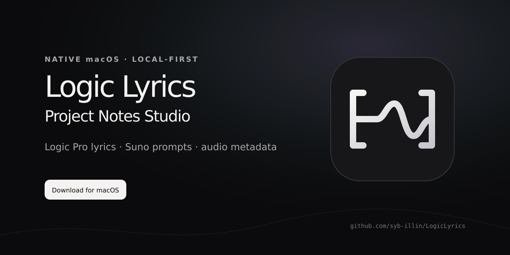

  

<h1 align="center">Logic Lyrics</h1>

  Recover and structure lyrics from Logic Pro projects, prepare voice-faithful Suno prompts, 
  and finish MP3/WAV metadata in one private, native macOS workflow.

  <a href="https://github.com/syb-illin/LogicLyrics/releases/latest/download/LogicLyrics.app.zip"><strong>Download for macOS</strong></a>
  · <a href="https://syb-illin.github.io/LogicLyrics/">Product page</a>
  · <a href="https://github.com/syb-illin/LogicLyrics/releases/latest">Latest release</a>
  · <a href="https://github.com/syb-illin/LogicLyrics/discussions">Discussions</a>

  
  
  
  

## Why Logic Lyrics

Logic Pro Project Notes are useful while a song is evolving, but they are awkward to recover, reorganize and move into the rest of a release workflow. Logic Lyrics turns the project itself into the source of truth: it reads the notes, detects musical context, makes the text editable, and keeps everything ready for the clipboard, Suno or final audio tags.

Your projects stay on your Mac. The app does not upload lyrics, prompts, audio, project names, file names or paths.

## Workflow

| Stage | What Logic Lyrics does |
| --- | --- |
| **Recover** | Opens `.logicx` packages and extracts embedded RTF Project Notes, BPM and musical key. |
| **Structure** | Detects markers such as `[Verse 1]`, `[Chorus]` and `[Outro]`; keeps lyrics editable and copyable by section. |
| **Prompt** | Produces separate **Styles**, **Styles to Exclude** and **Lyrics** blocks for ChatGPT, Gemini and Suno, without requiring an API key. |
| **Protect the voice** | Keeps the requested baritone identity, chest voice, grain and formants while excluding falsetto, screaming, singer replacement, unrealistic high notes and vocal acrobatics. |
| **Finish audio** | Reads and writes MP3/WAV metadata to a new file, previews artwork, displays technical audio details and converts WAV exports with LAME. |

Backing vocals are optional. Female backing vocals can be allowed explicitly without replacing the lead voice. BPM and key are always included at the beginning of the Suno Styles instructions.

## Download and install

### Ready-built app

1. Download [`LogicLyrics.app.zip`](https://github.com/syb-illin/LogicLyrics/releases/latest/download/LogicLyrics.app.zip).
2. Unzip it and move **Logic Lyrics** to Applications.
3. Open the app.

The public build is currently ad-hoc signed. Until Apple Developer ID signing and notarization are configured, macOS may require **System Settings → Privacy & Security → Open Anyway** on first launch. Checksums are published with every release.

### Trusted local build

Double-click `BUILD.command`. It needs Apple Command Line Tools, not the full Xcode application or Homebrew. The build validates the SDK and architecture, downloads and verifies LAME once, runs the regression suite, compiles with strict Swift concurrency checks, signs the app and places it in Downloads.

LAME is cached at `~/Library/Caches/com.local.LogicLyrics` and reused by future builds and updates. If a Developer ID Application identity exists in Keychain, the script detects it automatically. Set `LOGICLYRICS_NOTARY_PROFILE` to a configured `notarytool` profile to notarize and staple the result.

## Features

- Editable lyrics with automatic section recognition and per-section clipboard actions.
- Local history for projects, lyrics, prompts, BPM, key, artist reference and vocal settings.
- Safe experimental writing to a duplicate `.logicx`, including empty Notes insertion when a recognized structure is available.
- Audio metadata defaults for artist, current year, genre, cover artwork and tokenized filenames.
- Filename tokens: `{track}`, `{group}`, `{title}`, `{album}`, `{year}` and `{bpm}`.
- WAV/MP3 inspection: codec, sample rate, bit depth or bitrate, channel layout, duration and embedded artwork.
- Configurable LAME 3.100 MP3 conversion with CBR/VBR and sample-rate choices.
- Integrated automatic update checks that can be disabled, plus a visible **Check Now** result and explicit install confirmation.
- English and French localizations selected by macOS.
- VoiceOver semantics, keyboard alternatives, Reduce Motion, Reduce Transparency, scalable labels and non-color-only status communication.

## Logic project safety

Reading is non-destructive. Edited lyrics affect local history, exports, prompts and optional audio tags without changing the original project.

The experimental **Logic Copy** action only operates on a duplicate. It updates a recognized Notes record, validates redundant lengths, reads the result back and discards the temporary output if validation fails. Always open the resulting copy in Logic Pro before treating it as authoritative.

## Updates

The app can check GitHub Releases silently at launch. Disable this under **Settings → Updates** if desired. **Check Now** remains available and reports checking, up-to-date or update-available states. Installation only starts after explicit confirmation, verifies the downloaded source and checksum, rebuilds, then replaces the app at its current location.

Every release contains:

- `LogicLyrics.app.zip` and SHA-256 checksum;
- `LogicLyrics-macOS-source.zip` and SHA-256 checksum.

## Privacy, accessibility and diagnostics

- No analytics SDK and no application telemetry.
- Privacy-safe diagnostics use macOS Unified Logging and exclude user content.
- **Copy System Diagnostics** includes app/system configuration only.
- Accessibility behavior and verification are documented in [ACCESSIBILITY.md](ACCESSIBILITY.md).
- Logging and GitHub-only repository analytics are documented in [OBSERVABILITY.md](OBSERVABILITY.md).

The public [GitHub Insights dashboard](https://syb-illin.github.io/LogicLyrics/stats/) tracks repository traffic and release downloads only. It never receives data from the app.

## Requirements

- macOS 14 or later
- Logic Pro project using Project Notes
- Apple Command Line Tools for local builds

Validated sample: Logic Pro 12.2 (build 6644), RTF Project Notes. Open `LogicLyrics.xcodeproj` in Xcode 16 or later for IDE development.

## Contributing and support

Bug reports, focused feature requests and accessibility feedback are welcome. Read [CONTRIBUTING.md](CONTRIBUTING.md), use the repository [issue forms](https://github.com/syb-illin/LogicLyrics/issues/new/choose), or start a conversation in [Discussions](https://github.com/syb-illin/LogicLyrics/discussions).

The system boundaries and safety invariants are documented in [ARCHITECTURE.md](ARCHITECTURE.md). Security reports should follow [SECURITY.md](SECURITY.md).

If Logic Lyrics saves you time on a real project, starring the repository helps other Logic users find it.
