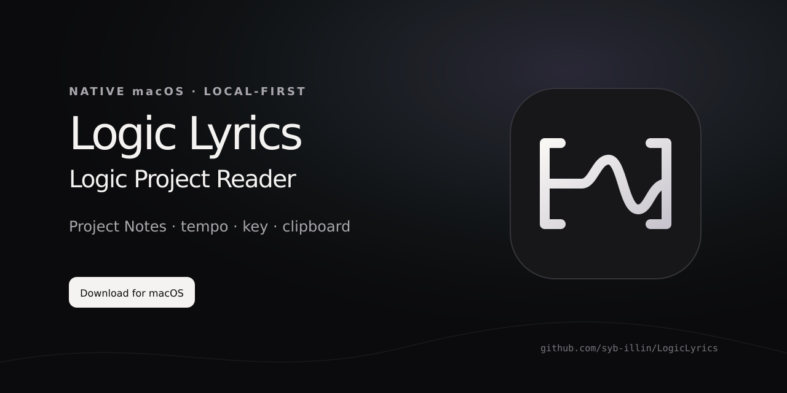

  

<h1 align="center">Logic Lyrics</h1>

  A focused native macOS reader for lyrics, tempo and key stored in Logic Pro Project Notes.

  <a href="https://github.com/syb-illin/LogicLyrics/releases/latest/download/LogicLyrics.app.zip"><strong>Download for macOS</strong></a>
  · <a href="https://syb-illin.github.io/LogicLyrics/">Product page</a>
  · <a href="https://github.com/syb-illin/LogicLyrics/releases/latest">Latest release</a>
  · <a href="https://github.com/syb-illin/LogicLyrics/discussions">Discussions</a>

  
  
  
  
  

## What it does

Logic Lyrics opens a `.logicx` package and reads Project Notes, BPM and musical key from the active or selected alternative. It recognizes markers such as `[Verse 1]`, `[Chorus]` and `[Outro]`, keeps Suno performance directives inside their section, lets you copy all lyrics or one section, and maintains a searchable local project history.

That is the complete product scope. There is no audio upload, prompt generator, metadata editor, MP3 encoder or Logic-project writer.

## Privacy and project safety

- Processing stays entirely on the Mac.
- The source Logic project is opened read-only and never modified.
- Lyrics, project names and paths are never written to logs or sent as telemetry.
- Recent-project bookmarks and snapshots are stored locally in Application Support.

## Download and install

Download [`LogicLyrics.app.zip`](https://github.com/syb-illin/LogicLyrics/releases/latest/download/LogicLyrics.app.zip), unzip it and move the app to Applications.

The public build is currently ad-hoc signed. Until Apple Developer ID signing and notarization are configured, macOS may require **System Settings → Privacy & Security → Open Anyway** on first launch. Checksums are published with every release.

### Lightweight local build

Double-click `BUILD.command`. It needs Apple Command Line Tools, not the full Xcode application, Homebrew or LAME. The script validates the SDK and source manifest, runs regression tests, compiles with strict Swift concurrency, signs the result and places `LogicLyrics.app` in Downloads.

If a Developer ID Application identity exists in Keychain, the script detects it automatically. Set `LOGICLYRICS_NOTARY_PROFILE` to a configured `notarytool` profile to notarize and staple the result.

## Features

- Native **File → Open Logic Pro Project…** command with `Command-O`.
- Drag and drop plus a sandboxed `.logicx` picker.
- Active-by-default alternative selection with technical-RTF false-positive protection and explicit extraction diagnostics.
- Manual `Command-R` refresh plus a visible warning when the selected project changes on disk.
- BPM, key, alternative and section-marker display.
- One-click clipboard actions for the complete lyrics and each detected section.
- Searchable, pinnable local history with remove/cleanup actions that follows moved or renamed files through macOS bookmarks.
- Separate actions to refresh lyrics, reveal a package in Finder or open it in Logic Pro.
- Automatic update checks that can be disabled, plus visible manual checks and explicit install confirmation.
- English and French localization, VoiceOver semantics, keyboard access, Reduce Motion and Reduce Transparency support.
- Privacy-safe Unified Logging and a bounded in-app diagnostic snapshot.

## Updates

The app can check GitHub Releases silently at launch. Disable this under **Settings → Updates** if desired. Installation only starts after explicit confirmation, pins that exact release, verifies its source archive, checksum and version manifest, rebuilds, then transactionally replaces the app at its current location with rollback protection.

Every release contains the ready-built app plus checksummed app and source archives.

## Requirements

- macOS 14 or later
- A Logic Pro `.logicx` project using Project Notes
- Apple Command Line Tools only when building locally

Validated sample: Logic Pro 12.2 (build 6644), RTF Project Notes. Open `LogicLyrics.xcodeproj` in Xcode 16 or later for IDE development.

## Contributing

Read [CONTRIBUTING.md](CONTRIBUTING.md), use the [issue forms](https://github.com/syb-illin/LogicLyrics/issues/new/choose), or start a conversation in [Discussions](https://github.com/syb-illin/LogicLyrics/discussions). Architecture, observability and accessibility are documented in [ARCHITECTURE.md](ARCHITECTURE.md), [OBSERVABILITY.md](OBSERVABILITY.md) and [ACCESSIBILITY.md](ACCESSIBILITY.md).

Logic Lyrics is available under the [MIT License](LICENSE).
